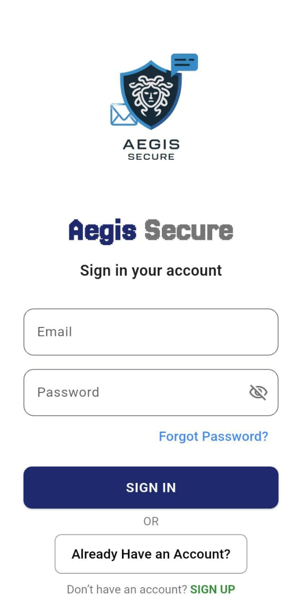
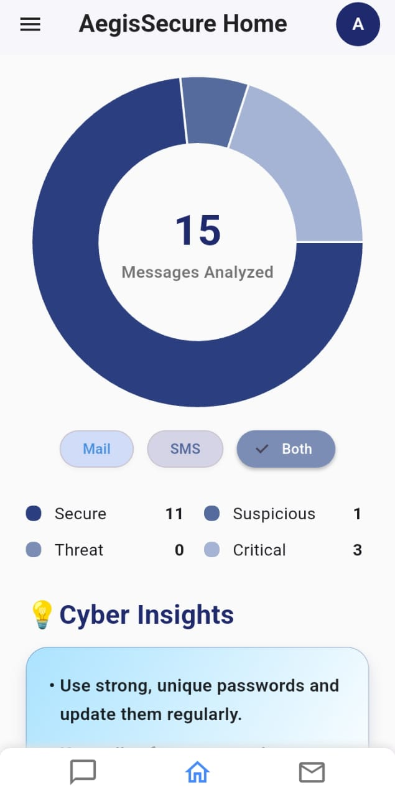
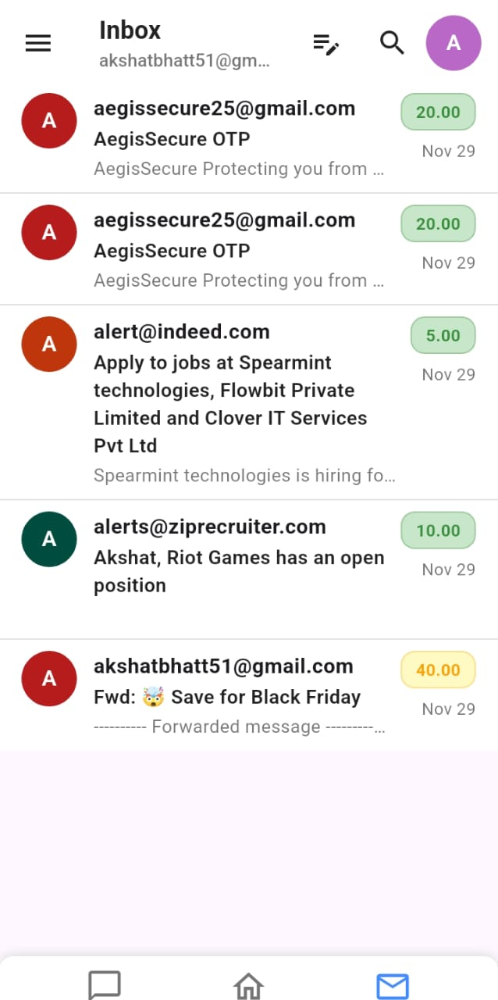
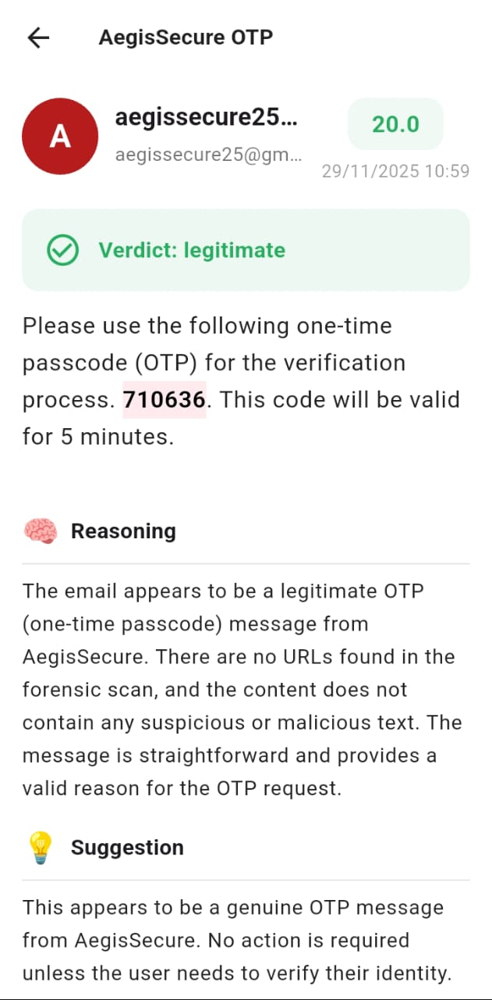

# 🛡️ AegisSecure — AI-Powered Cybersecurity Companion

🔗 **Live Demo:** [Demo Preview Link](https://youtu.be/0l0s7oldu2I)

---

## 🌐 Overview

**AegisSecure** is an cybersecurity application designed to protect users from **scam, phishing and Cyber attacks**.

It automatically fetches SMS and Emails in real time, analyzes them using an advanced ML model and provides:

- Scam prediction confidence score  
- Detailed reasoning  
- Actionable suggestions  
- Highlighted suspicious text  

---

## 🚀 Key Features

- 📩 **Real-Time SMS & Email Fetching**  
- 🤖 **AI-Powered Scam & Phishing Detection**  
- 🧠 **Reasoning + Safety Suggestions in Under 30 Seconds**  
- ✨ **Suspicious Keyword/Text Highlighting**  
- 📊 **Analytics Dashboard**  
- 💬 **Manual Message Analysis**  
- 🔍 **Cybersecurity Insights Using GenAI**

---

## ⚙️ Technical Highlights

- 🔐 **Secure Login & Registration**
- 🧬 **Detection Architecture Inspired by Human Reasoning**
- 🌐 **Uses Links, Metadata, and Semantics for Phishing Detection**
- ⚡ **Fast Inference & Real-Time Processing**

---

  

    
    
    
    
  

